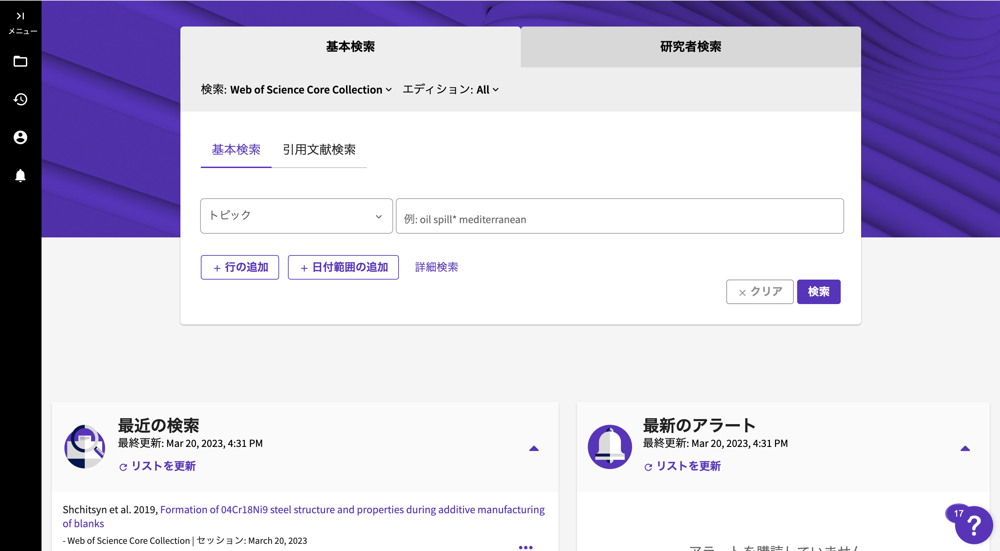

# 論文のスクレイピング (主要論文を検索して、Abstractから重要な情報を抜き出す.)



[Web of Science](https://www.webofscience.com/wos/woscc/basic-search)と呼ばれる論文検索サービスがある. (大学アカウントでアクセス可能)\
この論文データベースで指定したキーワードの情報を一覧にしてくれるパッケージをPythonで作成した. 

はじめに[検索ページ](https://www.webofscience.com/wos/woscc/basic-search)から指定したキーワードにヒットしたページのへのリンクを指定した分だけ抽出する. \
その後、[scrape.py](wos/scrape.py)より各リンク先のページからタイトル、出版日、著者、Abstractなどの情報を抜き出す.\
そして、Abstractを更に50~100文字程度に要点のみをまとめる.\
最後に論文のアブストラクトに含まれる定量データについての情報を正規表現で抜き出す.

## はじめに
本パッケージを使う前にweb of scienceのAPI Keyが必要となる. APIの取得方法については以下のサイトを参照\
[Web of Science API Lite](https://libguides.ucalgary.ca/c.php?g=732144&p=5260466)

## 使い方
自分の環境にソースコードをクローンする.
```
#clone
git clone "https://github.com/Shinnosuke2012/WebScraping.git"
cd WebScraping
#実行権限を与える
chmod +x env.sh
#主要なライブラリインストール
./env.sh
#プログラムの実行
python -m main.py
```

## 出力
出力は以下の通り

```
title : 論文タイトル
publication_date : 出版日
author : 著者
url : 論文URL
publisher : 出版社
summary of abstract : Abstractを50~100で要約したもの
value : 数値データ(e.g バッテリー容量のデータ)
keyword : 論文が属する種類
```

実行後、[Output](Output)にアクセスするとスクレイピング後の結果がjsonファイルとして出力される.
```json
{
    "id1": {
        "title": "Tuning local chemistry of P2 layered-oxide cathode for high energy and long cycles of sodium-ion battery | Nature Communications",
        "publication_date": "Published: 15 April 2021",
        "author": "Chenchen Wang1,  et al.",
        "url": "https://www.nature.com/articles/s41467-021-22523-3",
        "publisher": "Nature",
        "summary of abstract": "K+ is riveted in prismatic Na+ sites of P2-Na0.612K0.056MnO2 to enable more thermodynamically favorable Na+ vacancies. Mn-O bonds are reinforced to reduce phase transition during charge and discharge. It exhibits the highest specific capacity of 240.5 mAh g-1 and energy density of 654 Wh kg-1.",
        "capacity": {
            "value1": "240.5mAhg-1"
        }
    },
    "id2": {
        "title": "Boron-doped sodium layered oxide for reversible oxygen redox reaction in Na-ion battery cathodes | Nature Communications",
        "publication_date": "Published: 06 September 2021",
        "author": "Yu-Jie Guo1,2\u00a0na1,  et al.",
        "url": "https://www.nature.com/articles/s41467-021-25610-7",
        "publisher": "Nature",
        "summary of abstract": "The irreversible oxygen redox reaction at the high-voltage region in sodium layered cathode materials generates structural instability and poor capacity retention upon cycling. We report a doping strategy by incorporating light-weight boron into the cathode active material lattice to decrease the irreversible oxygen oxidation at high voltages. The B-doped cathode material promotes reversible transition metal redox.",
        "capacity": {
            "value1": "160.5mAhg-1"
        }
    },
    "id3": {
        "title": "Advanced rechargeable aluminium ion battery with a high-quality natural graphite cathode | Nature Communications",
        "publication_date": "Published: 13 February 2017",
        "author": "Di-Yan Wang1,2,3,  et al.",
        "url": "https://www.nature.com/articles/ncomms14283",
        "publisher": "Nature",
        "summary of abstract": "Aluminium ion batteries with aluminium anodes, graphite cathodes and ionic liquid electrolytes have increased. Here, an aluminium ion battery cell made using pristine natural graphite flakes achieves a specific capacity of \u223c110mAhg-1. Raman spectroscopy shows two different intercalation processes involving chloroaluminate anions.",
        "capacity": {
            "value1": "110mAhg-1",
            "value2": "60mAhg-1"
        }
    },
}
```

## 参考文献
[1] [【NLP】Hugging Faceの🤗Transformersことはじめ](https://qiita.com/Papillon6814/items/8565d23017d0451b2c94)\
[2] [PythonのBeautifulSoupを使ったGoogle scholarのスクレイピング （論文情報, 複合検索, 引用推移）](https://zenn.dev/ebidora/articles/ec096777db70a2)\
[3] [Google Scholarから論文の基本情報をpython で取得する](https://qiita.com/kuto/items/9730037c282da45c1d2b)
